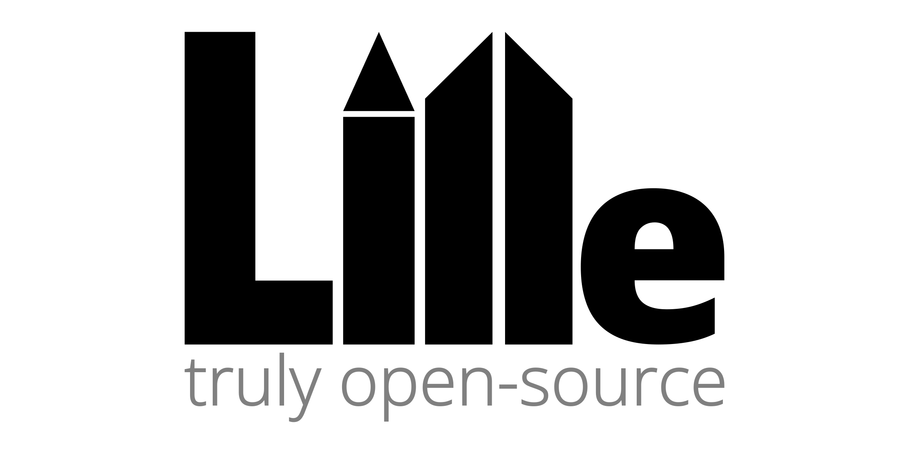

# Lille 130M



## Table of Contents
1. [Model Summary](#-model-summary)
2. [Evaluation](#-evaluation)
3. [How to Use](#-how-to-use)
4. [Training and Finetuning](#-training-and-finetuning)
5. [Training Details](#-training-details)
6. [Limitations](#-limitations)
7. [The Truly Open-Source Stack](#-the-truly-open-source-repos)
8. [License](#-license)
9. [Citation](#-citation)

## ✨ Model Summary

**Lille** is a 130-million-parameter language model built from the ground up as a core component of a completely open-source deep learning stack. The name Lille reflects both its compact size and strong capabilities - capturing the idea that less can be more. It draws on the Norwegian word lille (‘small’ or ‘little’) as well as the French city Lille, giving it both meaning and place. It was trained using a custom tokenizer, a curated dataset, and a memory-efficient optimizer, all of which are publicly available.

The model comes in two versions:
*   **`Lille-130M-Base`**: The foundational model pretrained on 4.27 billion of tokens from the [FineWeb-Edu](https://huggingface.co/datasets/HuggingFaceFW/fineweb-edu) dataset. A post-processing step to only include the highest quality of content was added. It has strong general knowledge and text completion abilities.
*   **`Lille-130M-Instruct`**: The instruction-tuned version, fine-tuned on the **[Kyoto-Corpus](https://huggingface.co/datasets/Nikity/Kyoto-Corpus)**. It excels at following user commands, engaging in chat, and performing a variety of instruction-based tasks.

The model architecture is a modern Transformer decoder featuring Grouped-Query Attention (GQA), RoPE, and RMSNorm, making it efficient and performant for its size.

*Note on parameter count: While the model name is `130M` for simplicity, the actual parameter count is closer to 140 million.*

## 📊 Evaluation

All evaluations were conducted using **[simple-eval](https://github.com/Nikityyy/simple-eval)**, our open-source evaluation framework. Benchmarks are run in a zero-shot setting unless specified otherwise.

#### `Lille-130M-Instruct`


> Evaluations for other LLMs are sourced from the <a href="https://huggingface.co/spaces/open-llm-leaderboard/open_llm_leaderboard">Open LLM Leaderboard</a> or their respective model cards when benchmark data is unavailable. For Lille 140M Instruct, evaluations are performed using <a href="https://github.com/Nikityyy/simple-eval">simple-eval</a>. ARC-C and ARC-E for Smollm2 are also evaluated using <a href="https://github.com/Nikityyy/simple-eval">simple-eval</a>.

## 🚀 How to Use

### 1. SimpleAI SDK (Recommended for Easy Use)

The easiest way to get started with Lille is by using the `simpleai-sdk`, which handles all the boilerplate for you and provides a simple, high-level API for both Hugging Face and ONNX backends.

```bash
pip install simpleai-sdk
```

```python
from simple_ai import lille

# This will download and cache the model on first run.
# Specify the model version: "130m-instruct" (default) or "130m-base"
# Specify the backend: "huggingface" (default) or "onnx"
model = lille("huggingface", "130m-instruct") 

# --- For Chat (with instruct model) ---
print("--- Chat Example ---")
response1 = model.chat("What is the capital of France?", max_new_tokens=50)
print(f"Bot: {response1}")

response2 = model.chat("And what is its population?", max_new_tokens=50, top_p=0.90)
print(f"Bot: {response2}")

# This resets the chat history
model.reset_chat()

# --- For Text Completion (with base or instruct model) ---
prompt = "Artificial Intelligence is"
response = model.generate(prompt, max_new_tokens=50, temperature=0.9)
print(f"\n--- Completion Example ---\n{prompt}{response}")
```

### 2. Standard Hugging Face Transformers (this also needs `simpleai-sdk` currently)

You can also use the model directly with the `transformers` library for more advanced use cases.

```bash
pip install transformers torch simpleai-sdk
```

```python
import torch
from transformers import AutoTokenizer, AutoConfig, AutoModelForCausalLM
from simple_ai.model_hf import LilleConfig, LilleForCausalLM

# 1. Register the custom model architecture with Hugging Face
AutoConfig.register("lille-130m", LilleConfig)
AutoModelForCausalLM.register(LilleConfig, LilleForCausalLM)

# 2. Define constants and setup device
MODEL = "Nikity/lille-130m-instruct"
DEVICE = "cuda" if torch.cuda.is_available() else "cpu"

# 3. Load tokenizer and model
tokenizer = AutoTokenizer.from_pretrained(MODEL)
model = AutoModelForCausalLM.from_pretrained(
    MODEL,
    torch_dtype="auto",
    device_map=DEVICE,
)

# 4. Prepare chat prompt and tokenize it
chat = [{"role": "user", "content": "What is the capital of France?"}]
inputs = tokenizer.apply_chat_template(
    chat,
    add_generation_prompt=True,
    return_tensors="pt"
).to(DEVICE)

# 5. Generate a response
with torch.inference_mode():
    outputs = model.generate(
        input_ids=inputs,
        max_new_tokens=512,
        eos_token_id=tokenizer.eos_token_id,
        pad_token_id=tokenizer.pad_token_id,
        do_sample=True,
        temperature=0.5,
        top_p=0.95,
    )

# 6. Decode and print the response
response = tokenizer.decode(outputs[0][inputs.shape[1]:], skip_special_tokens=True)
print(response)
```

## 🚀 Training and Finetuning

You can replicate the pretraining of `Lille-130M-Base` or fine-tune it on your own dataset using the provided scripts.

#### 1. Setup

First, clone the repository and install the required dependencies:

```bash
git clone https://github.com/Nikityyy/lille
cd lille
pip install -r requirements.txt
```

**Note on the Optimizer:** The default `Sophia-Triton` optimizer requires the [Triton](https://triton-lang.org/main/getting-started/installation.html) library. Triton is officially supported on Linux with NVIDIA GPUs. While experimental installation on Windows is possible, it can be a complex and difficult process. For a much simpler setup on **Windows and macOS**, or if you prefer not to install Triton, it is highly recommended to use a pure PyTorch implementation of Sophia instead:

1.  Replace the contents of the `sophia_triton.py` file with the code from [this link](https://github.com/Liuhong99/Sophia/blob/main/sophia.py).
2.  The `train.py` script should work without any import changes, as the class name `SophiaG` is the same.

#### 2. Data Preparation

The training script expects data in a specific `.npz` format containing tokenized documents and their offsets.

**For Pretraining (like FineWeb-Edu):**

Use the `prepare_dataset_fineweb.py` script. It will stream the dataset from Hugging Face, apply filters, tokenize the text, and save it in the required format.

```bash
python prepare_dataset_fineweb.py
```
This will create `data/fineweb_edu_sample_10BT/train.npz` and `val.npz`.

**For Finetuning (Instruction Datasets):**

Use the `prepare_dataset.py` script. Your input data should be a single `.txt` file where each example is separated by the `<|endoftext|>` token.

1.  Place your data file, for example, at `data/my_dataset/train.txt`.
2.  Modify the `input_file_path` and `output_dir` variables in `prepare_dataset.py`.
3.  Run the script:

```bash
python prepare_dataset.py
```
This will create `train.npz` and `val.npz` in your specified output directory.

#### 3. Running the Training Script

All training logic is handled by `train.py`. You can configure hyperparameters directly at the top of this file.

**To Pretrain from Scratch:**

1.  Ensure you have prepared a pretraining dataset.
2.  In `train.py`, set `finetune = False`.
3.  Configure pretraining parameters like `data_dir`, `batch_size`, etc.
4.  Run the script:

```bash
python train.py
```

**To Fine-tune a Pretrained Model:**

1.  Ensure you have prepared a fine-tuning dataset.
2.  In `train.py`, set `finetune = True`.
3.  Set `resume_checkpoint` to the path of the pretrained model checkpoint (e.g., `checkpoints/best_model.pt`).
4.  Configure fine-tuning parameters like `finetune_data_dir` and `finetune_learning_rate`.
5.  Run the script:

```bash
python train.py
```

Checkpoints will be saved in the directory specified by `out_dir` (for pretraining) or `finetune_out_dir` (for fine-tuning). The best model based on validation loss will be saved as `best_model.pt`.

## 🛠️ Training Details

### Pretraining (`Lille-130M-Base`)
*   **Dataset:** Pretrained on **4.27 billion tokens** from the `sample-10BT` configuration of the [HuggingFaceFW/fineweb-edu](https://huggingface.co/datasets/HuggingFaceFW/fineweb-edu) dataset.
*   **Tokenizer:** The custom **[Hastings](https://github.com/Nikityyy/Hastings)** tokenizer with a 32,768 vocabulary size.
*   **Optimizer:** The memory-efficient **[Sophia-Triton](https://github.com/Nikityyy/Sophia-Triton)** optimizer.
*   **Hardware:** Trained on a single NVIDIA RTX 4070-TI.
*   **Precision:** bfloat16.

### Instruction Tuning (`Lille-130M-Instruct`)
*   **Dataset:** Supervised Fine-Tuning (SFT) was performed on the **[Kyoto-Corpus](https://github.com/Nikityyy/Kyoto-Corpus)**, a high-quality, curated collection of conversational and instructional data.

### Model Architecture
*   **Type:** Transformer Decoder
*   **Layers:** 24
*   **Embedding Size:** 640
*   **Attention Heads:** 10
*   **KV Heads (GQA):** 2
*   **Context Length:** 512 tokens

## Limitations

Lille models primarily understand and generate content in English. While powerful for their size, they can produce text that may not always be factually accurate, logically consistent, or free from biases present in the training data. These models should be used as assistive tools rather than definitive sources of information. Users should always verify important information and critically evaluate any generated content.

## 🛠️ The truly open-source repos

Lille is a key component of my initiative to build and release a complete, truly open-source stack for language modeling. All components are designed to work together seamlessly.

*   **Tokenizer:** **[Hastings](https://github.com/Nikityyy/Hastings)** - A modern, efficient tokenizer with a 32k vocabulary.
*   **Dataset:** **[Kyoto-Corpus](https://github.com/Nikityyy/Kyoto-Corpus)** - A high-quality, small-scale dataset for instruction tuning.
*   **Model:** **[lille](https://github.com/Nikityyy/lille)** (this repository) - A powerful 130-million-parameter model trained from scratch.
*   **Optimizer:** **[Sophia-Triton](https://github.com/Nikityyy/Sophia-Triton)** - A memory-efficient, Triton-based implementation of the SophiaG optimizer.
*   **Evaluations:** **[simple-eval](https://github.com/Nikityyy/simple-eval)** - A straightforward framework for evaluating model performance using an LLM as a Judge.

## 📜 License

This project is licensed under the Apache-2.0 License.

## Citation

If you use Lille or any part of this open-source stack in your work, please consider citing it:

```bibtex
@misc{lille-130m,
  author       = {Nikita Berger},
  title        = {Lille: A Truly Open-Source 130M Language Model},
  year         = {2025},
  publisher    = {GitHub},
  journal      = {GitHub repository},
  howpublished = {\url{https://github.com/Nikityyy/lille}}
}
```
